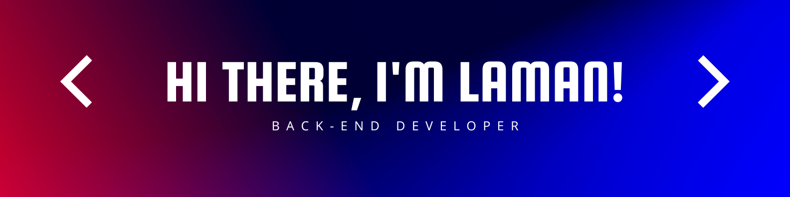

### :woman_technologist: About Me :
I am a Back End Developer  from Azerbaijan.

- 🌱 I’m currently learning **Django Rest Framework**

- 💬 Ask me about **Python, Django, Flask, Rest API**

- :zap: In my free time, I solve problems on HackerRank and read tech articles.

- 📫 How to reach me **lamankalbiyeva@gmail.com**, 

#

### :hammer_and_wrench: Languages and Tools :

 

 
  
 

 

 

#

### 🔥 My Stats :

 

